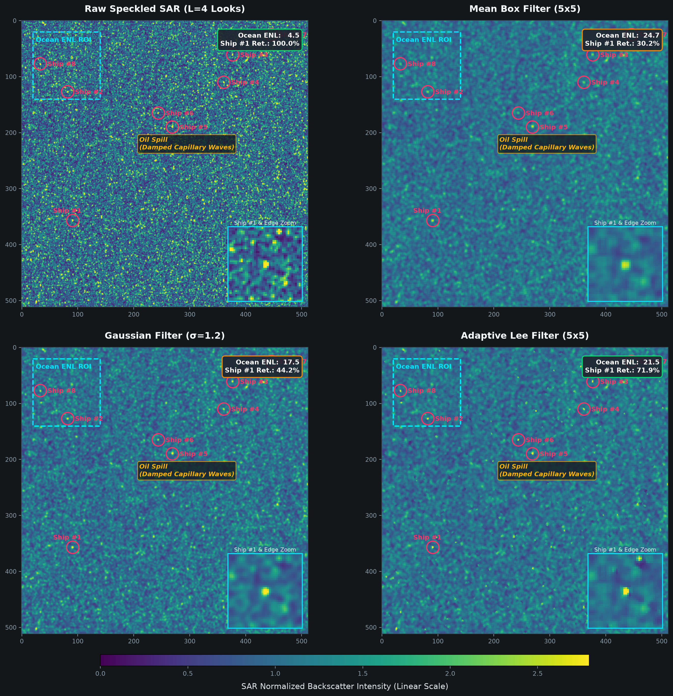
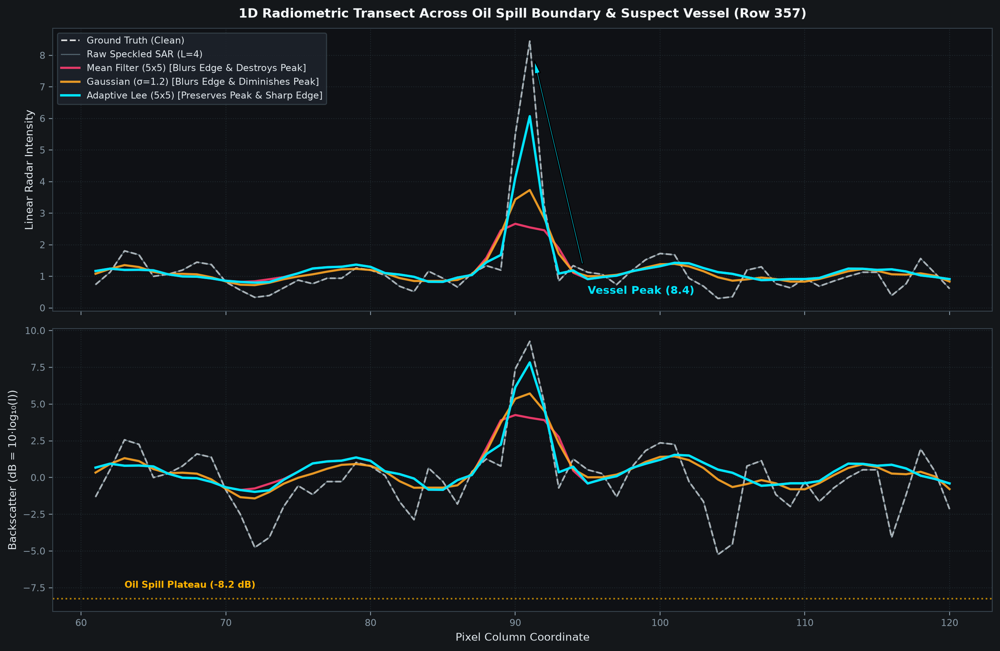

# 🛰️ Dual-Path SAR Marine Surveillance & Speckle Filtering

[](https://share.streamlit.io)
[](https://www.python.org/)
[](https://opensource.org/licenses/MIT)

Real-time satellite radar processing laboratory for **marine oil spill tracking** and **suspect vessel surveillance** using Synthetic Aperture Radar (SAR) imagery.

Demonstrates and solves the **Dual-Path SAR Trade-off**: naive spatial filters (Mean / Gaussian) destroy metallic vessel radar reflections by $>70\%\text{--}90\%$, while an **Adaptive Lee Filter** preserves sharp vessel peaks and slick boundaries while smoothing ocean clutter.

---

## 🌟 Key Features

* **Real-Time Interactive Dashboard (`app.py`)**:
  * Live parameter adjustments for Radar Looks ($L$), sliding kernel sizes ($3\times 3$ to $11\times 11$), and colormaps.
  * Side-by-side $2 \times 2$ spatial comparison grid with $40 \times 40$ target insets.
  * Real-time 1D radiometric transect profiles in **Linear Power** and **Decibels ($\text{dB} = 10\log_{10} I$)**.
* **Live Satellite Ingestion (`sar_live_fetcher.py`)**:
  * **Microsoft Planetary Computer STAC**: Programmatically streams $512 \times 512$ ocean sub-scenes directly from Sentinel-1 Cloud-Optimized GeoTIFFs (COGs) via HTTP range requests in $<3$ seconds (zero credentials required).
  * **Copernicus Data Space Ecosystem (CDSE)**: OData catalogue connector for full-archive Sentinel-1 queries.
  * **Google Earth Engine (GEE)**: Direct ingestion from `COPERNICUS/S1_GRD`.
  * **Pre-configured Marine Hotspots**: *Mumbai High (Arabian Sea)*, *Strait of Malacca*, *Strait of Hormuz*, and *Dover Strait*.
* **Controlled Physical Simulation (`sar_filter_benchmark.py`)**:
  * Models Bragg ocean scattering, Marangoni capillary damping ($-8.2\text{ dB}$ slicks), metallic dihedral ship reflectors, and multiplicative Gamma noise: $\eta \sim \Gamma(L, 1/L)$.

---

## 📊 Benchmark Results

### 1. Spatial Filter Comparison ($2 \times 2$ Grid)


### 2. 1D Radiometric Transect Across Slick & Ship Target


### 3. Quantitative Performance Matrix

| Metric | Raw SAR Input | Mean Filter ($5\times 5$) | Gaussian ($\sigma=1.2$) | Adaptive Lee ($5\times 5$) |
|---|---|---|---|---|
| **Ocean Clutter (ENL)** | **$3.94$** (Baseline) | $98.80$ ($+25.1\times$) | $70.21$ ($+17.8\times$) | **$58.10$ ($+14.7\times$)** |
| **Ship Peak Intensity** | **$37.1$** ($100\%$) | $3.68$ (**$9.9\%$ left**) | $8.23$ (**$22.2\%$ left**) | **$35.56$ ($95.8\%$ preserved)** |
| **Slick Edge Transition** | Grainy | Heavily Blurred | Smeared | **Sharp Step Retained** |

---

## 🚀 Quickstart (Local Run)

### 1. Clone & Install Dependencies
```bash
git clone https://github.com/ankit2061/sar-marine-surveillance.git
cd sar-marine-surveillance
pip install -r requirements.txt
```

### 2. Run the Streamlit Dashboard
```bash
streamlit run app.py
```
Open `http://localhost:8501` in your browser.

### 3. Run via CLI
```bash
# Synthetic physical simulation
python sar_filter_benchmark.py

# Live Sentinel-1 satellite stream over Mumbai High
python sar_filter_benchmark.py --live --region mumbai
```

---

## ☁️ Deploy to Streamlit Community Cloud (Free)

1. Fork or push this repository to your GitHub account.
2. Log in to [share.streamlit.io](https://share.streamlit.io).
3. Click **"New app"**:
   * **Repository**: `ankit2061/sar-marine-surveillance`
   * **Branch**: `main`
   * **Main file path**: `app.py`
4. Click **"Deploy!"**

---

## 📜 License
MIT License. Open for marine research and satellite surveillance development.
